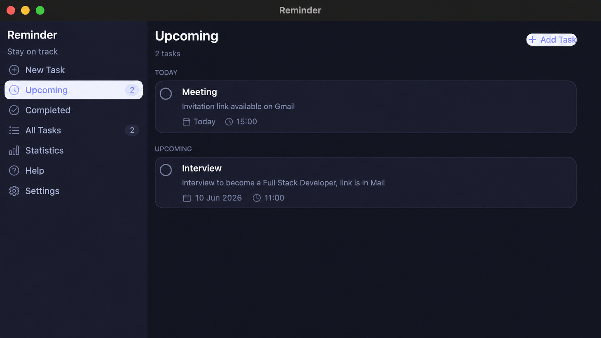
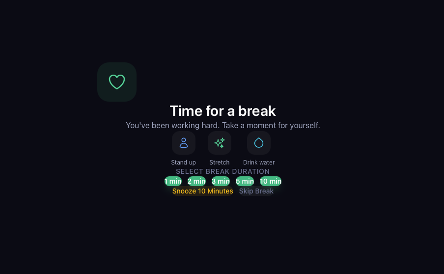
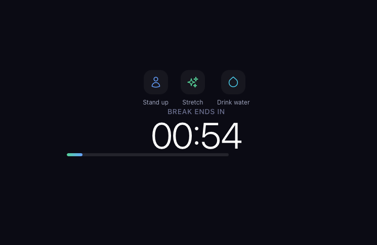
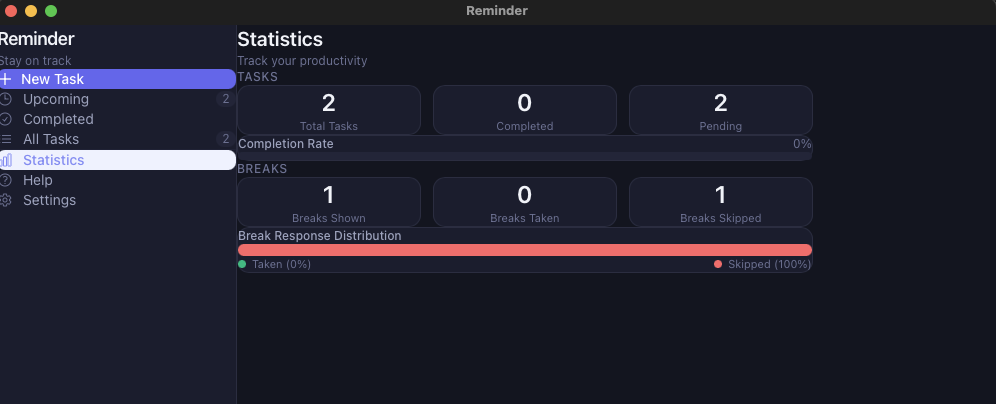
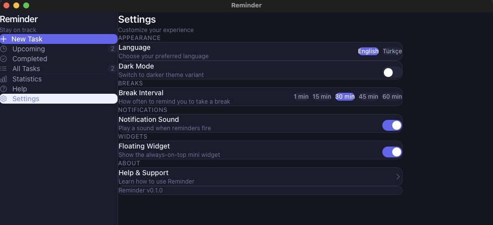

<p align="center">
  
</p>

<h1 align="center">Re-Minder</h1>

<p align="center">
  Task scheduler, break reminder, and focus tracker for macOS. Native, lightweight, runs in the background.
</p>

<p align="center">
  
  
  
  
  
</p>

## Definition

Developers spend most of the day staring at a screen. Meeting times get mixed up, deadlines slip, and taking a break to drink water or stretch feels like a luxury during a long coding session.

Re-Minder sits in your menu bar, reminds you when a task is due, and nudges you to take breaks at regular intervals. It's a native macOS app built with Tauri -- not Electron -- so it stays light on memory and launches instantly.

No account, no server, no internet connection required. Everything is stored locally on your machine.

## Screenshots

<p align="center">
  
</p>

<p align="center">
  
  
</p>

<p align="center">
  
  
</p>

## Download

Grab the latest `Reminder.app` from the [Releases](https://github.com/gorkemergune/re-mind/releases) page. Drag it into your `Applications` folder and open it.

> If macOS blocks the app on first launch, go to **System Settings > Privacy & Security** and click **Open Anyway**.

## What It Does

**Task Scheduling** -- Create tasks with a title, optional description, date, time, and repeat mode (once, daily, weekdays, weekly). When a task is due you get a native macOS notification, an in-app popup, and a sound alert.

**Pre-Reminder Notifications** -- Before a task's scheduled time the app shows a small, non-intrusive toast card in the top-right corner at configurable offsets: 60, 30, 15, and 5 minutes in advance. Each toast auto-dismisses after 12 seconds and is never shown twice for the same offset.

**Break Reminders** -- Every 30 minutes (configurable) the app shows a fullscreen overlay encouraging you to step away, drink water, or stretch. You can take the break, skip it, or snooze it -- the app tracks your response either way. Break timing uses absolute timestamps stored in `localStorage` and is driven by a Rust background thread, so it triggers reliably even when the window is minimised or hidden in the tray.

**Focus Analytics** -- The app silently tracks how long the window is in the foreground, split by date and hour. The Statistics page uses this data to show:
- Total focus time over the last 28 days
- A weekly bar chart (last 7 days)
- A 14-day × 18-hour heatmap with per-cell intensity scaling
- Automated insights: peak focus hour, average daily focus time, best day of the week, late-night work patterns, and break compliance

**Floating Widget** -- A small always-on-top card showing the current time, your next upcoming task, and the real-time countdown until your next break. Reads the same `localStorage` timestamp as the main window so the countdown stays accurate. Drag it to a second monitor and keep it in view while you work.

**System Tray** -- Closing the window doesn't quit the app. It keeps running in the tray with quick access to open the app, add a task, pause breaks, or quit entirely.

**Statistics** -- A dashboard showing task completion rate, break behaviour, and the full focus analytics described above.

**Settings** -- Break interval (1/15/30/45/60 min), break duration (1-10 min), notification sound toggle, dark/light mode, widget visibility, and language (English or Turkish with auto-detection).

## Build From Source

### Prerequisites

- macOS 12.0+
- [Node.js](https://nodejs.org) 18+
- [Rust](https://rustup.rs) 1.70+
- Xcode Command Line Tools -- `xcode-select --install`

### Steps

```bash
git clone https://github.com/gorkemergune/re-mind.git
cd re-mind
npm install
npm run tauri build
```

The compiled app bundle will be at:

```
src-tauri/target/release/bundle/macos/Reminder.app
```

Move it to `/Applications` and launch.

### Development

```bash
npm run tauri dev
```

Frontend changes are hot-reloaded.

## How Data Is Stored

All data lives in a local SQLite database. Nothing is sent anywhere.

| Table              | Content                                                                                 |
| ------------------ | --------------------------------------------------------------------------------------- |
| `tasks`            | Scheduled tasks -- title, description, date, time, repeat mode, completion status       |
| `break_stats`      | Counters -- breaks shown, breaks taken, breaks skipped                                  |
| `settings`         | User preferences -- break interval, duration, theme, language, sound, widget visibility |
| `focus_sessions`   | Focus time per date and hour -- used for heatmap and productivity insights               |

Database location:

```
~/Library/Application Support/com.gorkemergune.reminder/reminder.db
```

The database is created on first launch. Each user gets their own independent database -- cloning this repo gives you a clean slate with no pre-existing data.

You can inspect it directly:

```bash
sqlite3 ~/Library/Application\ Support/com.gorkemergune.reminder/reminder.db
```

```sql
SELECT * FROM tasks;
SELECT * FROM break_stats;
SELECT * FROM settings;
SELECT date, hour, focus_minutes FROM focus_sessions ORDER BY date, hour;
```

## Architecture Notes

**Break timer reliability** -- JavaScript `setInterval` is throttled by WKWebView when the window is hidden or the app is in the tray. Re-Minder avoids this by storing the next-break timestamp as an absolute Unix millisecond value in `localStorage` (`reminder_next_break_at`). A Rust background thread emits a `backend-tick` event every 30 seconds; the frontend listener compares `Date.now()` against the stored timestamp regardless of how much JavaScript execution was throttled. The `visibilitychange` event triggers an additional check each time the window comes back to the foreground.

**Notification deduplication** -- Each task notification (main and each pre-reminder offset) is tracked in `localStorage` under `reminder_notified_v2`. Keys survive app restarts so past-due tasks don't re-notify after relaunch.

**Focus tracking** -- The `useFocusTracker` hook uses the Page Visibility API to record when the app window enters and leaves the foreground. Sessions are flushed to the SQLite backend every 60 seconds, split across hour boundaries so the heatmap can show per-hour granularity.

## Tech Stack

|               |                                                                                                                  |
| ------------- | ---------------------------------------------------------------------------------------------------------------- |
| Desktop       | [Tauri v2](https://v2.tauri.app) (Rust)                                                                          |
| Frontend      | [React 19](https://react.dev), [TypeScript 5.8](https://www.typescriptlang.org) (strict mode)                    |
| Styling       | [Tailwind CSS v4](https://tailwindcss.com)                                                                       |
| State         | [Zustand v5](https://zustand.docs.pmnd.rs)                                                                       |
| Database      | SQLite via [rusqlite](https://github.com/rusqlite/rusqlite) (bundled)                                            |
| Notifications | [tauri-plugin-notification](https://v2.tauri.app/plugin/notification/), [react-hot-toast](https://react-hot-toast.com) |
| Animations    | [canvas-confetti](https://github.com/catdad/canvas-confetti)                                                     |

## License

[MIT](LICENSE)
